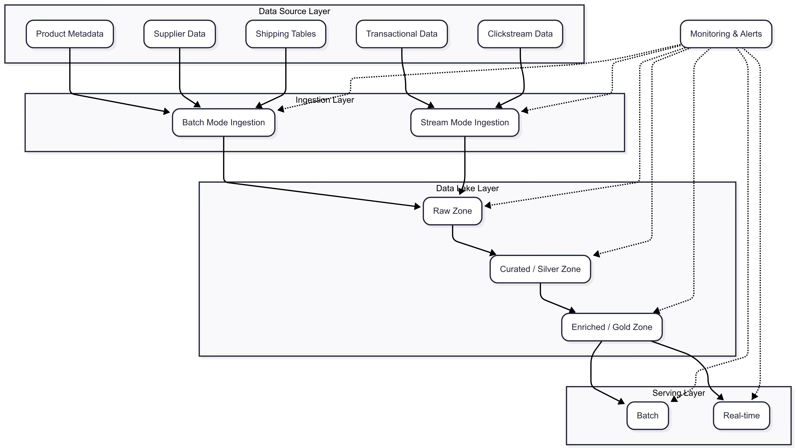

Dynamic Product Pricing MVP
This project implements a Minimum Viable Product (MVP) for a dynamic product pricing system for a B2B e-commerce platform. The solution is built using Apache Spark and Delta Lake within a Databricks environment, demonstrating key data engineering concepts including multi-layered data lake architecture, data transformation, and feature engineering.

1. Summary of Solution
The primary goal of this MVP is to:

Load Product and Transaction Data: Ingest raw product metadata and transactional data.

Identify Anchor Products: Determine "anchor" products based on criteria such as sales popularity, profit margin, and conversion rate. Anchor products are high-impact items that can influence the pricing of other products.

Suggest Pricing for Non-Anchor Products: Propose dynamic pricing for non-anchor products using an "anchor-aware price tiering" strategy within their respective categories. This logic aims to optimize pricing while maintaining desired profit margins.

Persist Results: Store the processed data and final suggested pricing in Delta Lake format, organized into Bronze, Silver, and Gold layers of a data lake.

The solution utilizes a Medallion Architecture (Bronze, Silver, Gold) on Databricks, leveraging Unity Catalog Volumes for persistent storage, ensuring data quality, reliability, and auditability throughout the pipeline.

2. Setup Instructions
This prototype is designed to run on Databricks Community Edition with Unity Catalog Volumes enabled.

Databricks Workspace:

Ensure you have access to a Databricks Community Edition workspace.

Cluster Configuration:

Create or use an existing cluster in your Databricks workspace.

Ensure the cluster is running a recent Databricks Runtime version (e.g., 10.4 LTS or newer, which includes Delta Lake support).

Verify that your cluster has access to Unity Catalog Volumes. The code assumes a volume path like /Volumes/workspace/default/myvol. If your volume path is different, update the VOLUME_PATH variable in the notebook accordingly.

Import Notebook:

Import the provided Jupyter notebook (dynamic_pricing_mvp.ipynb) into your Databricks workspace.

3. How to Run the Pipeline
Attach to Cluster: Open the imported notebook and attach it to your configured Databricks cluster.

Run All Cells: Execute all cells in the notebook sequentially. The notebook is structured to perform the following steps:

Initialize SparkSession (handled automatically by Databricks).

Generate synthetic product and transactional data.

Write raw data to the Bronze Layer (Delta Lake tables at /Volumes/workspace/default/myvol/data_lake/bronze/).

Process data, identify anchor products, and write to the Silver Layer (Delta Lake table at /Volumes/workspace/default/myvol/data_lake/silver/).

Apply dynamic pricing logic to suggest prices for non-anchor products.

Write the final suggested pricing results to the Gold Layer (Delta Lake table at /Volumes/workspace/default/myvol/data_lake/gold/).

Display intermediate and final DataFrames using display() for verification.

4. Code Structure and Comments
The code within the dynamic_pricing_mvp.ipynb notebook is structured into logical steps, with clear comments explaining the purpose and logic of each section. This enhances readability and maintainability.

5. AI-Assisted Coding Tools Used
During the development of this prototype, AI-assisted coding tools (such as Gemini/ChatGPT) were utilized. These tools provided valuable support in:

Generating boilerplate code and synthetic data for rapid prototyping.

Assisting with PySpark DataFrame transformations and complex SQL queries.

Suggesting best practices for Delta Lake implementation and data pipeline design.

Aiding in debugging and troubleshooting environment-specific errors